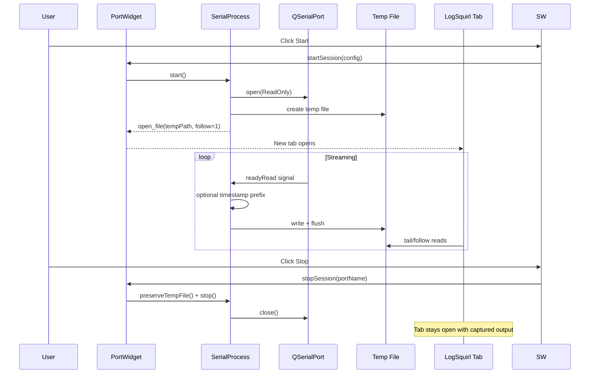
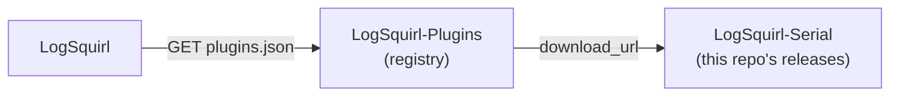

# logsquirl-serial — Serial Monitor Plugin for LogSquirl

[](https://github.com/64x-lunicorn/LogSquirl-Serial/actions/workflows/ci-build.yml)
[](LICENSE)
[](https://github.com/64x-lunicorn/LogSquirl-Serial/releases)
[](https://github.com/64x-lunicorn/LogSquirl-Serial/commits/main)
[]()

A [LogSquirl](https://github.com/64x-lunicorn/LogSquirl) plugin that streams
serial port data from connected devices directly into LogSquirl tabs.
Supports **multiple parallel ports**, full **serial parameter configuration**
(baud rate, data bits, stop bits, parity, flow control), optional
**line timestamps**, a configurable **log directory** with automatic filenames,
and a **sidebar panel** for port selection and session control.

This plugin also serves as a **reference implementation / sample plugin** for
the LogSquirl Plugin SDK.  Every design decision is documented, and the code
is heavily commented to help you build your own plugins.

## Features

- **Port Discovery** — Automatic serial port enumeration with one-click refresh
- **Multi-Port** — Capture data from multiple serial ports simultaneously
- **Live Tailing** — Each port opens in its own LogSquirl tab with follow mode
- **Full Serial Config** — Baud rate, data bits, stop bits, parity, and flow
  control — all configurable per session
- **Timestamps** — Optional `[YYYY-MM-DD HH:mm:ss.zzz]` prefix on each received line
- **Log Directory** — Configurable log save path with automatic filename
  generation (`YYYY-MM-dd_HHmmss_<portName>.log`); path is persisted across
  sessions
- **Sidebar Panel** — Integrated sidebar tab with port dropdown, serial
  configuration, start/stop, and active session list with rotate and stop
  buttons
- **Persistent Logs** — Captured output remains visible in LogSquirl after
  stopping a session
- **Bluetooth Filtering** — Virtual Bluetooth serial ports are automatically
  hidden from the port list
- **Cross-Platform** — Works on macOS, Linux, and Windows
- **Use LogSquirl Filters** — No built-in filtering; leverage LogSquirl's
  powerful regex search and highlighters on the raw serial output

## Prerequisites

- **LogSquirl** ≥ 26.03 with the plugin system enabled
- **Qt6** (Core + Widgets + SerialPort) — same version LogSquirl was built with
- **CMake** ≥ 3.16
- A C++17-capable compiler (GCC ≥ 9, Clang ≥ 14, MSVC ≥ 19.29)

## Build

```bash
# Clone
git clone https://github.com/64x-lunicorn/LogSquirl-Serial.git
cd LogSquirl-Serial

# Configure
cmake -B build -S . -DCMAKE_BUILD_TYPE=Release

# If Qt6 is not in PATH (e.g. Homebrew on macOS):
cmake -B build -S . -DCMAKE_BUILD_TYPE=Release \
  -DCMAKE_PREFIX_PATH="$(brew --prefix qt6)"

# Build
cmake --build build

# The shared library is in build/:
#   macOS:   build/liblogsquirl_serial.dylib
#   Linux:   build/liblogsquirl_serial.so
#   Windows: build/logsquirl_serial.dll
```

### Running Tests

```bash
cmake -B build -S . -DCMAKE_BUILD_TYPE=Release -DBUILD_TESTS=ON
cmake --build build
cd build && ctest --output-on-failure
```

## Install

Copy the plugin library **and** `plugin.json` into one of LogSquirl's
plugin search directories:

| Platform | Plugin Directory |
|----------|-----------------|
| macOS    | `~/Library/Application Support/logsquirl/plugins/io.github.logsquirl.serial/` |
| Linux    | `~/.local/share/logsquirl/plugins/io.github.logsquirl.serial/` |
| Windows  | `%APPDATA%/logsquirl/plugins/io.github.logsquirl.serial/` |

```bash
# Example for macOS:
DEST="$HOME/Library/Application Support/logsquirl/plugins/io.github.logsquirl.serial"
mkdir -p "$DEST"
cp build/liblogsquirl_serial.dylib "$DEST/"
cp plugin.json "$DEST/"
```

Or use `cmake --install`:

```bash
cmake --install build --prefix "$HOME/.local"
```

After installing, restart LogSquirl (or re-scan via *Plugins → Manage Plugins…*).

## Usage

1. **Enable the plugin** in *Plugins → Manage Plugins…* — check
   "Serial Monitor" and click OK.  (On first run, the plugin is
   auto-enabled if no other plugins are configured.)

2. The **Serial** sidebar tab appears automatically.  Use the sidebar panel
   to manage sessions:

   - **Port dropdown** — Select a connected serial port.
   - **Refresh** — Re-scan for serial ports.
   - **Serial settings** — Configure baud rate, data bits, stop bits, parity,
     flow control, and timestamps per session.
   - **Start** — Begin capturing serial data for the selected port.
     A new tab opens in LogSquirl with live output in follow mode.
   - **Stop** — Stop the capture for the selected port.
     The tab remains open with all captured output preserved.

3. **Active Sessions** — Running sessions are listed below the controls.
   Each session row shows the port name with:
   - **↻** — Rotate log (close current session, start a new one)
   - **■** — Stop the session

4. **Log directory** — Set a directory path in the "Log Directory" section.
   Use the **Browse** button or type a path directly.  Log files are
   automatically named `YYYY-MM-dd_HHmmss_<portName>.log`.

5. **Multiple ports** — Select another port, click Start again.
   Each port gets its own tab and session entry.

6. **Configure defaults** — *Plugins → Manage Plugins…* → select plugin →
   Configure.  Set the default baud rate for new sessions.

## Architecture

```mermaid
graph TD
    subgraph LogSquirl Host
        H[MainWindow]
        SB[Sidebar Panel]
    end

    subgraph Plugin — C ABI Boundary
        P[plugin.cpp<br/>get_info / init /<br/>shutdown / configure]
        SW[SidebarWidget<br/>port selector + session list]
        PW[PortWidget<br/>session management]
        SP1[SerialProcess #1<br/>/dev/ttyUSB0]
        SP2[SerialProcess #2<br/>COM3]
    end

    H -- register_sidebar_tab --> P
    P -- creates --> SW
    SW -- uses --> PW
    SW --> SB
    PW -- manages --> SP1
    PW -- manages --> SP2
    SP1 -- writes --> TF1[Temp File #1]
    SP2 -- writes --> TF2[Temp File #2]
    TF1 -- open_file follow=1 --> H
    TF2 -- open_file follow=1 --> H
```

### Data Flow



### Key Design Decisions

| Decision | Rationale |
|----------|-----------|
| **Plugin type = UI** | The DataSource type is limited to 1 stream per plugin. UI type allows managing multiple independent streams. |
| **open_file() instead of push_line()** | Each port writes to its own temp file. The host opens each file with follow/tail mode → one tab per port. |
| **register_sidebar_tab()** | Plugin registers a sidebar widget that is always visible while the plugin is loaded. The sidebar contains port selection, serial configuration, session controls, and active session list. |
| **QSerialPort** | Cross-platform, integrates with Qt event loop, no need for threading or external libraries. |
| **Optional timestamps** | Embedded devices often don't include timestamps.  The plugin can prepend reception time for correlation. |
| **No built-in filtering** | LogSquirl's regex search and highlighters are more powerful than any filter we could build. |
| **Bluetooth filtering** | Virtual Bluetooth serial ports are rarely useful for log capture and clutter the port list. |
| **Library name without extension** | `plugin.json` uses `"library": "logsquirl_serial"` — QLibrary resolves the platform suffix automatically. |

## Project Structure

```
logsquirl-serial/
├── CMakeLists.txt              # Standalone build — finds Qt6, builds shared lib
├── plugin.json                 # Plugin manifest (cross-platform)
├── LICENSE                     # GPL-3.0-or-later
├── README.md                   # This file
├── CHANGELOG.md                # Release history
├── .gitignore
├── include/
│   └── logsquirl_plugin_api.h  # Vendored SDK header (MIT license)
├── src/
│   ├── plugin.h                # Global state shared across translation units
│   ├── plugin.cpp              # C ABI entry points (get_info, init, shutdown)
│   ├── serialprocess.h         # Serial port discovery + per-port session wrapper
│   ├── serialprocess.cpp
│   ├── portwidget.h            # Session management (start/stop/rotate)
│   ├── portwidget.cpp
│   ├── sidebarwidget.h         # LogSquirl sidebar tab (port list + controls)
│   └── sidebarwidget.cpp
├── tests/
│   ├── CMakeLists.txt          # Catch2 test setup
│   ├── tests_main.cpp          # QApplication + Catch2 runner
│   ├── plugininfo_test.cpp
│   ├── parseportlist_test.cpp
│   └── serialprocess_test.cpp
└── docs/
    └── DEVELOPER_GUIDE.md      # How to use this as a plugin template
```

## Plugin Registry

This plugin is listed in the
[LogSquirl-Plugins](https://github.com/64x-lunicorn/LogSquirl-Plugins) registry.
LogSquirl users can install it directly from **Plugins → Browse Plugins…** without
manual file copying.

When publishing a new release, update the corresponding entries in
[`plugins.json`](https://github.com/64x-lunicorn/LogSquirl-Plugins/blob/main/plugins.json)
via pull request — see the
[Contributing Guide](https://github.com/64x-lunicorn/LogSquirl-Plugins/blob/main/CONTRIBUTING.md).



## Using This as a Plugin Template

This plugin is designed to be a starting point for your own LogSquirl plugins.
See [docs/DEVELOPER_GUIDE.md](docs/DEVELOPER_GUIDE.md) for a step-by-step
guide on how the Plugin SDK works, annotated code walkthroughs, and tips for
building your own plugins.

**Quick start to fork this as a template:**

1. Copy this directory
2. Rename the library in `CMakeLists.txt`
3. Update `plugin.json` with your plugin's identity
4. Modify `plugin.cpp` entry points
5. Replace `SerialProcess` + `PortWidget` with your own logic
6. Build and install

## License

This plugin is licensed under the **GNU General Public License v3.0 or later**
(GPL-3.0-or-later).

The vendored `include/logsquirl_plugin_api.h` header is licensed under the
**MIT License** to allow plugins of any license to use the LogSquirl Plugin SDK.
