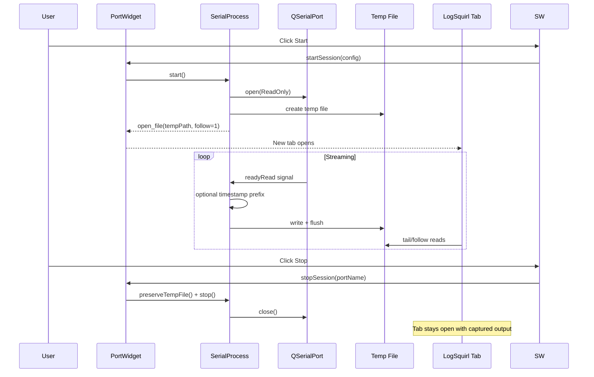
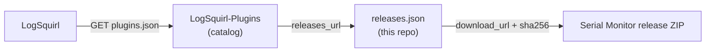

<!-- Allow GitHub's presentation markup and a logo before the main heading. -->
<!-- markdownlint-configure-file {"MD033": {"allowed_elements": ["div", "img"]}, "MD041": false} -->

<div align="center">


# Serial Monitor

**Every port its own tab.**

**A [LogSquirl](https://github.com/64x-lunicorn/LogSquirl) plugin that streams
serial data straight into the log viewer.**

Open several ports at once, set baud rate and parity per session, and read the
output with the same regex search and highlighters you use on any other log.

[](https://github.com/64x-lunicorn/LogSquirl-Serial/actions/workflows/ci-build.yml)
[](https://github.com/64x-lunicorn/LogSquirl-Serial/releases/latest)
[](https://github.com/64x-lunicorn/LogSquirl-Serial/releases)
[](#install)
[](LICENSE)

[Install](#install) &nbsp;/&nbsp;
[Usage](#usage) &nbsp;/&nbsp;
[Build](#build) &nbsp;/&nbsp;
[Architecture](#architecture) &nbsp;/&nbsp;
[Changelog](CHANGELOG.md)

</div>

---

## Why this plugin?

A serial console shows you the last screenful and forgets the rest. Piping to a
file means you stop watching. This plugin puts the stream where your other logs
already are.

| Less setup | More signal |
| :--- | :--- |
| **Ports found for you.** Automatic enumeration with one-click refresh; virtual Bluetooth ports are hidden so the list stays short. | **Configure the link.** Baud rate, data bits, stop bits, parity and flow control, set per session. |
| **Every port its own tab.** Start as many as you like — each opens its own LogSquirl tab in follow mode. | **Timestamped on arrival.** Optional `[YYYY-MM-DD HH:mm:ss.zzz]` prefix, for devices that send none. |
| **Nothing lost on stop.** Captured output stays in the tab after the session ends. | **Filter with the host.** No filter UI of its own — LogSquirl's regex search and highlighters do it better. |
| **Written to disk.** Configurable log directory, automatic `YYYY-MM-dd_HHmmss_<port>.log` names, path remembered. | **A worked example.** Heavily commented reference implementation for the Plugin SDK. |

## Install

### From LogSquirl

*Plugins → Browse Plugins…* → **Serial Monitor** → **Install**. The archive is
downloaded, verified against its SHA-256 checksum and loaded — no file copying.

### From a release

Download the archive for your platform from the
[releases page](https://github.com/64x-lunicorn/LogSquirl-Serial/releases/latest)
and unpack it into LogSquirl's plugin directory:

| Platform | Plugin Directory |
|----------|-----------------|
| macOS    | `~/Library/Application Support/logsquirl/plugins/io.github.logsquirl.serial/` |
| Linux    | `~/.local/share/logsquirl/plugins/io.github.logsquirl.serial/` |
| Windows  | `%APPDATA%/logsquirl/plugins/io.github.logsquirl.serial/` |

### From source

See [Build](#build), then:

```bash
DEST="$HOME/Library/Application Support/logsquirl/plugins/io.github.logsquirl.serial"
mkdir -p "$DEST"
cp build/liblogsquirl_serial.dylib "$DEST/"
cp plugin.json icon.png "$DEST/"
```

Or `cmake --install build --prefix "$HOME/.local"`.

After installing, restart LogSquirl or re-scan via *Plugins → Manage Plugins…*.

## Usage

1. **Enable the plugin** in *Plugins → Manage Plugins…* — check
   "Serial Monitor" and click OK.  (On first run, the plugin is
   auto-enabled if no other plugins are configured.)

2. The **Serial** sidebar tab appears automatically.  Use the sidebar panel
   to manage sessions:

   - **Port dropdown** — Select a connected serial port.
   - **Refresh** — Re-scan for serial ports.
   - **Serial settings** — Configure baud rate, data bits, stop bits, parity,
     flow control, and timestamps per session.
   - **Start** — Begin capturing serial data for the selected port.
     A new tab opens in LogSquirl with live output in follow mode.
   - **Stop** — Stop the capture for the selected port.
     The tab remains open with all captured output preserved.

3. **Active Sessions** — Running sessions are listed below the controls.
   Each session row shows the port name with:
   - **↻** — Rotate log (close current session, start a new one)
   - **■** — Stop the session

4. **Log directory** — Set a directory path in the "Log Directory" section.
   Use the **Browse** button or type a path directly.  Log files are
   automatically named `YYYY-MM-dd_HHmmss_<portName>.log`.

5. **Multiple ports** — Select another port, click Start again.
   Each port gets its own tab and session entry.

6. **Configure defaults** — *Plugins → Manage Plugins…* → select plugin →
   Configure.  Set the default baud rate for new sessions.

## Prerequisites

- **LogSquirl** ≥ 26.03 with the plugin system enabled
- **Qt6** (Core + Widgets + SerialPort) — same version LogSquirl was built with
- **CMake** ≥ 3.16
- A C++17-capable compiler (GCC ≥ 9, Clang ≥ 14, MSVC ≥ 19.29)

## Build

```bash
# Clone
git clone https://github.com/64x-lunicorn/LogSquirl-Serial.git
cd LogSquirl-Serial

# Configure
cmake -B build -S . -DCMAKE_BUILD_TYPE=Release

# If Qt6 is not in PATH (e.g. Homebrew on macOS):
cmake -B build -S . -DCMAKE_BUILD_TYPE=Release \
  -DCMAKE_PREFIX_PATH="$(brew --prefix qt6)"

# Build
cmake --build build

# The shared library is in build/:
#   macOS:   build/liblogsquirl_serial.dylib
#   Linux:   build/liblogsquirl_serial.so
#   Windows: build/logsquirl_serial.dll
```

### Running Tests

```bash
cmake -B build -S . -DCMAKE_BUILD_TYPE=Release -DBUILD_TESTS=ON
cmake --build build
cd build && ctest --output-on-failure
```

## Architecture

```mermaid
graph TD
    subgraph LogSquirl Host
        H[MainWindow]
        SB[Sidebar Panel]
    end

    subgraph Plugin — C ABI Boundary
        P[plugin.cpp<br/>get_info / init /<br/>shutdown / configure]
        SW[SidebarWidget<br/>port selector + session list]
        PW[PortWidget<br/>session management]
        SP1[SerialProcess #1<br/>/dev/ttyUSB0]
        SP2[SerialProcess #2<br/>COM3]
    end

    H -- register_sidebar_tab --> P
    P -- creates --> SW
    SW -- uses --> PW
    SW --> SB
    PW -- manages --> SP1
    PW -- manages --> SP2
    SP1 -- writes --> TF1[Temp File #1]
    SP2 -- writes --> TF2[Temp File #2]
    TF1 -- open_file follow=1 --> H
    TF2 -- open_file follow=1 --> H
```

### Data Flow


```mermaid
sequenceDiagram
    participant User
    participant PW as PortWidget
    participant SP as SerialProcess
    participant Port as QSerialPort
    participant TF as Temp File
    participant LS as LogSquirl Tab

    User->>SW: Click Start
    SW->>PW: startSession(config)
    PW->>SP: start()
    SP->>Port: open(ReadOnly)
    SP->>TF: create temp file
    SP-->>PW: open_file(tempPath, follow=1)
    PW-->>LS: New tab opens
    loop Streaming
        Port->>SP: readyRead signal
        SP->>SP: optional timestamp prefix
        SP->>TF: write + flush
        LS->>TF: tail/follow reads
    end
    User->>SW: Click Stop
    SW->>PW: stopSession(portName)
    PW->>SP: preserveTempFile() + stop()
    SP->>Port: close()
    Note over LS: Tab stays open with captured output
```

### Key Design Decisions

| Decision | Rationale |
|----------|-----------|
| **Plugin type = UI** | The DataSource type is limited to 1 stream per plugin. UI type allows managing multiple independent streams. |
| **open_file() instead of push_line()** | Each port writes to its own temp file. The host opens each file with follow/tail mode → one tab per port. |
| **register_sidebar_tab()** | Plugin registers a sidebar widget that is always visible while the plugin is loaded. The sidebar contains port selection, serial configuration, session controls, and active session list. |
| **QSerialPort** | Cross-platform, integrates with Qt event loop, no need for threading or external libraries. |
| **Optional timestamps** | Embedded devices often don't include timestamps.  The plugin can prepend reception time for correlation. |
| **No built-in filtering** | LogSquirl's regex search and highlighters are more powerful than any filter we could build. |
| **Bluetooth filtering** | Virtual Bluetooth serial ports are rarely useful for log capture and clutter the port list. |
| **Library name without extension** | `plugin.json` uses `"library": "logsquirl_serial"` — QLibrary resolves the platform suffix automatically. |

## Project Structure

```
logsquirl-serial/
├── CMakeLists.txt              # Standalone build — finds Qt6, builds shared lib
├── plugin.json                 # Plugin manifest (cross-platform)
├── LICENSE                     # GPL-3.0-or-later
├── README.md                   # This file
├── CHANGELOG.md                # Release history
├── .gitignore
├── include/
│   └── logsquirl_plugin_api.h  # Vendored SDK header (MIT license)
├── src/
│   ├── plugin.h                # Global state shared across translation units
│   ├── plugin.cpp              # C ABI entry points (get_info, init, shutdown)
│   ├── serialprocess.h         # Serial port discovery + per-port session wrapper
│   ├── serialprocess.cpp
│   ├── portwidget.h            # Session management (start/stop/rotate)
│   ├── portwidget.cpp
│   ├── sidebarwidget.h         # LogSquirl sidebar tab (port list + controls)
│   └── sidebarwidget.cpp
├── tests/
│   ├── CMakeLists.txt          # Catch2 test setup
│   ├── tests_main.cpp          # QApplication + Catch2 runner
│   ├── plugininfo_test.cpp
│   ├── parseportlist_test.cpp
│   └── serialprocess_test.cpp
└── docs/
    └── DEVELOPER_GUIDE.md      # How to use this as a plugin template
```

## Plugin Registry

This plugin is listed in the
[LogSquirl-Plugins](https://github.com/64x-lunicorn/LogSquirl-Plugins) catalog,
so it installs from **Plugins → Browse Plugins…** with no manual file copying.

The catalog holds **one entry per plugin** and does not change between releases.
Versions, download URLs and checksums live in this repository's
[`releases.json`](releases.json) — update that when you publish a release, and
fill in every `sha256`: an empty checksum silently disables verification in the
host.


```mermaid
flowchart LR
    LS["LogSquirl"] -- "GET plugins.json" --> C["LogSquirl-Plugins<br/>(catalog)"]
    C -- "releases_url" --> RJ["releases.json<br/>(this repo)"]
    RJ -- "download_url + sha256" --> Z["Serial Monitor release ZIP"]
```

## Using This as a Plugin Template

This plugin is designed to be a starting point for your own LogSquirl plugins.
See [docs/DEVELOPER_GUIDE.md](docs/DEVELOPER_GUIDE.md) for a step-by-step
guide on how the Plugin SDK works, annotated code walkthroughs, and tips for
building your own plugins.

**Quick start to fork this as a template:**

1. Copy this directory
2. Rename the library in `CMakeLists.txt`
3. Update `plugin.json` with your plugin's identity
4. Modify `plugin.cpp` entry points
5. Replace `SerialProcess` + `PortWidget` with your own logic
6. Build and install

## License

GPL-3.0-or-later — see [LICENSE](LICENSE) for the full license text.

The vendored `include/logsquirl_plugin_api.h` header is MIT-licensed, so
plugins of any license can build against the LogSquirl Plugin SDK without
taking on GPL obligations. See [NOTICE](NOTICE) for details.
