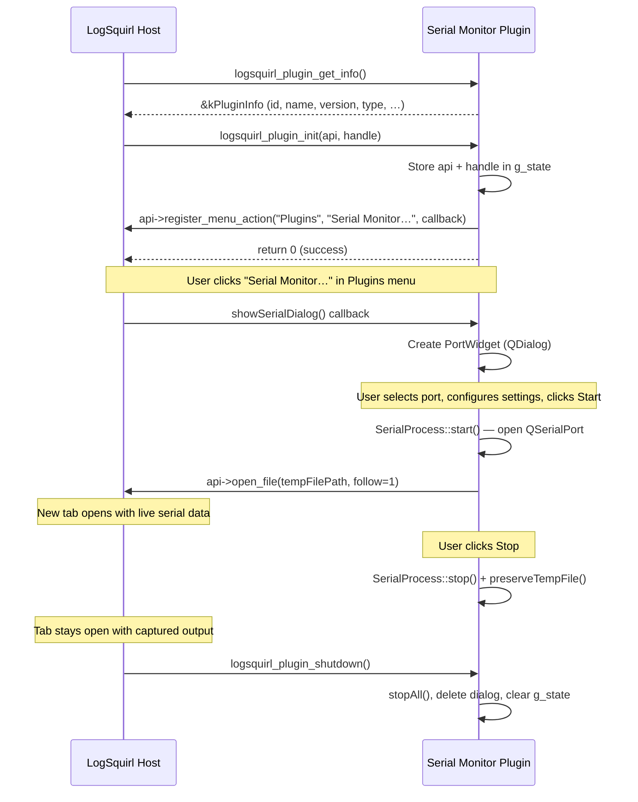
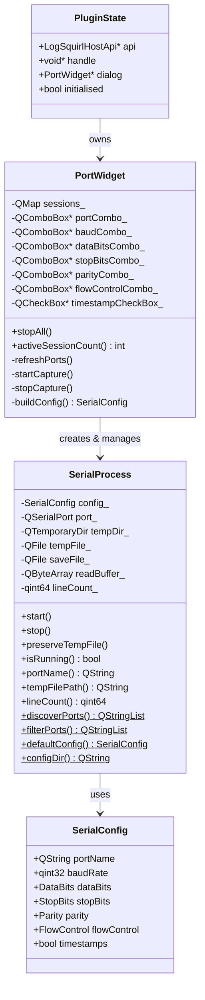

# Developer Guide — LogSquirl Serial Monitor Plugin

This guide explains how the Serial Monitor plugin works under the hood,
how the LogSquirl Plugin SDK is used, and how to adapt this code to
build your own plugin.

## Plugin SDK Overview

The LogSquirl Plugin SDK is a **pure C ABI** interface.  A plugin is a
shared library (`.dylib` / `.so` / `.dll`) that exports four C functions:

| Symbol | Purpose |
|--------|---------|
| `logsquirl_plugin_get_info()` | Return static metadata (called before init) |
| `logsquirl_plugin_init()` | Receive host API, set up the plugin |
| `logsquirl_plugin_shutdown()` | Tear down, release all resources |
| `logsquirl_plugin_configure()` | Open a settings dialog (optional) |

The host provides a function-pointer table (`LogSquirlHostApi`) that the
plugin uses to interact with the application.

## Plugin Lifecycle



## Class Diagram



## Key Implementation Details

### Serial Port Discovery

`SerialProcess::discoverPorts()` uses `QSerialPortInfo::availablePorts()`
to enumerate ports.  The `filterPorts()` method excludes:

- **Bluetooth virtual ports** — matched by description or manufacturer
  containing "bluetooth" (case-insensitive)
- **Phantom entries** — ports with no system location

### Data Streaming

When a session starts:

1. A `QTemporaryDir` is created for this session
2. A temp file is opened inside it: `serial_<portName>.log`
3. `QSerialPort` is configured and opened in `ReadOnly` mode
4. The `readyRead` signal triggers `onReadyRead()`:
   - Data is read into a buffer
   - Complete lines (split on `\n`) are processed
   - If timestamps are enabled, `[YYYY-MM-DD HH:mm:ss.zzz] ` is prepended
   - Each line is written to the temp file (and save file if enabled)
   - Files are flushed after each line for real-time tailing

### Timestamp Format

When enabled, each line is prefixed:

```
[2026-03-25 14:30:00.123] Original serial data here
```

This uses `QDateTime::currentDateTime()` — the timestamp reflects when
LogSquirl **received** the line, not when the device sent it.

### Session Persistence

When the user clicks Stop:

1. `preserveTempFile()` sets `tempDir_.setAutoRemove(false)`
2. `stop()` closes the serial port and flushes remaining data
3. The `SerialProcess` is deleted, but the temp file remains on disk
4. The LogSquirl tab continues to display all captured data

## Building Your Own Plugin

1. **Copy this directory** — it's a complete, standalone CMake project
2. **Update `plugin.json`** — give your plugin a unique `id`, `name`, etc.
3. **Rename the library** in `CMakeLists.txt` (`logsquirl_serial` → your name)
4. **Implement your logic** — replace `SerialProcess` with your data source
5. **Keep the C ABI** — the four exported functions must be present
6. **Use the host API** — `open_file()`, `log_message()`, `show_notification()`
7. **Register UI** — `register_menu_action()` for menu items, or
   `register_status_widget()` for status bar widgets

### Minimal plugin.cpp

```cpp
#include "logsquirl_plugin_api.h"

static const LogSquirlPluginInfo kInfo = {
    "com.example.myplugin", "My Plugin", "1.0.0",
    "Description", "Author", "MIT",
    LOGSQUIRL_PLUGIN_UI, LOGSQUIRL_PLUGIN_API_VERSION,
};

extern "C" {

LOGSQUIRL_PLUGIN_EXPORT const LogSquirlPluginInfo* logsquirl_plugin_get_info( void )
{
    return &kInfo;
}

LOGSQUIRL_PLUGIN_EXPORT int logsquirl_plugin_init( const LogSquirlHostApi* api, void* handle )
{
    api->log_message( handle, LOGSQUIRL_LOG_INFO, "Hello from my plugin!" );
    api->register_menu_action( handle, "Plugins", "My Plugin…", &myCallback, nullptr );
    return 0;
}

LOGSQUIRL_PLUGIN_EXPORT void logsquirl_plugin_shutdown( void )
{
    // Cleanup
}

LOGSQUIRL_PLUGIN_EXPORT void logsquirl_plugin_configure( void* parent_widget )
{
    // Optional: open a settings dialog
}

} // extern "C"
```

## Testing

The plugin uses [Catch2 v2](https://github.com/catchorg/Catch2/tree/v2.x)
with BDD-style macros (`SCENARIO` / `GIVEN` / `WHEN` / `THEN`).

Tests are compiled with the plugin sources linked directly into the test
binary — no need to load the `.dylib` at runtime.

```bash
cmake -B build -S . -DBUILD_TESTS=ON
cmake --build build
cd build && ctest --output-on-failure
```

### Test Categories

| Tag | Description |
|-----|-------------|
| `[plugininfo]` | Verify C ABI metadata struct |
| `[filterports]` | Port list filtering logic |
| `[discoverports]` | Port discovery integration |
| `[serialprocess]` | SerialProcess construction and defaults |
